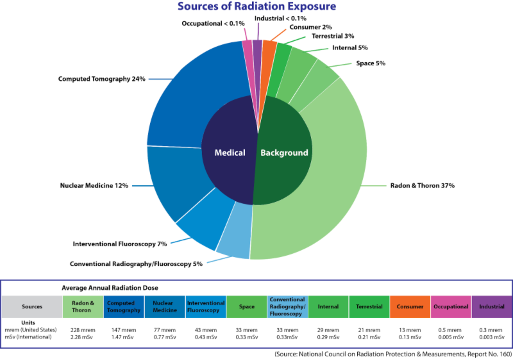

Radiation is one of the most dangerous things in the world to the environment. Radiation can easily cause mass death of local wildlife. Radiation can also cause one of the most deadly infections in the world with one of the highest death rates. Although radiation may seem like some uncontainable force, most radioactive sources can be contained,we just haven't found out how to do so. This article will go over the effects and the containment of radioactive waste.

The main cause of radiation is metals like plutonium, uranium,... these materials all emanate radiation but these can all be contained. The most effective method to contain radioactive metals is to surround them in lead, which can block most radioactive effects, and then covering the metal in concrete in large structures or in dump sites but this doesn't always work.

Now metals can be contained short-term but how do we contain them long-term. Our main issue now isn't containing it long-term because the knowledge of it would need to be passed down through generations and if forgotten could cause the death of random people. The main point for this being an issue is that if humanity made a button that would destroy the whole universe humans only a couple of generations down would press it if they were not told.

So the best method that we think of right now would be to bury the waste in lead and copper lined tools and pass the information down through generations. Although this may not work. Why? Because even a sign would decay and at some point the information would be forgotten.

Radiation effects on an environment can be disastrous. The main reason for that is because it breaks down DNA which can cause cancer and if bad enough can cause your body to rot. This can cause large amounts of dead wildlife and greate waste-lands due to it because nothing can grow there without dying. This can also cause water supplies to become contaminated with small metal pieces of radioactive waste which causes most wildlife down-stream to become irradiated and can if bad enough kill everything along the stream and any wildlife that drinks the water.

The main problem that this boils down to is the length of time that radiation lasts. Radioactive sources can last upwards of longer than 1-2k years. This causes most methods of containing waste not to be very effective due to it only being able to last 500 years. This is a massive issue because when radioactive waste seeps out into the ground it can pollute water and kill most wildlife above it and in surrounding regions.

Right now our best method of dealing with nuclear waste is to put it somewhere and forget about it. This causes a lot of issues like ground/water pollution which can cause the issues stated above. Right now we are working on storage silos for large waste disposal that could last 4,000+ years but these aren't perfect. Most of the materials used in these projects will not last the required time and may be harmful to future life. Our most effective method now is using copper and lead tubes and sealed in with dry clay and covered in concrete. 

Nuclear waste can cause a lot of issues but it can be avoided. The 3 main points to avoiding radiation are first time, second is distance and third is shielding. Radiation is very deadly but only 3 seconds of exposure will not cause any issues. Secondly the distance to the sources is very important because the farther you are away, the farther it has to move to get to you, and the more of it is lost in travel. Third is shielding, which is about shielding yourself from it because radiation is mostly stopped by a lot of materials. Our most effective right now is lead.

Now nuclear waste may seem like this dangerous thing that we should not use but not usually. Radiation is very useful and I think if you're interested to learn more, I would suggest you educate yourself on how to stay safe. Radiation may seem like this mystifying thing but I hope this article cleared up some facts on what happens to mismanaged waste.

----

[^1]: [It can take up to 10 minutes for changes to your site to publish after you push the changes to GitHub](https://docs.github.com/en/pages/setting-up-a-github-pages-site-with-jekyll/creating-a-github-pages-site-with-jekyll#creating-your-site).

[Just the Docs]: https://just-the-docs.github.io/just-the-docs/
[GitHub Pages]: https://docs.github.com/en/pages
[README]: https://github.com/just-the-docs/just-the-docs-template/blob/main/README.md
[Jekyll]: https://jekyllrb.com
[GitHub Pages / Actions workflow]: https://github.blog/changelog/2022-07-27-github-pages-custom-github-actions-workflows-beta/
[use this template]: https://github.com/just-the-docs/just-the-docs-template/generate
